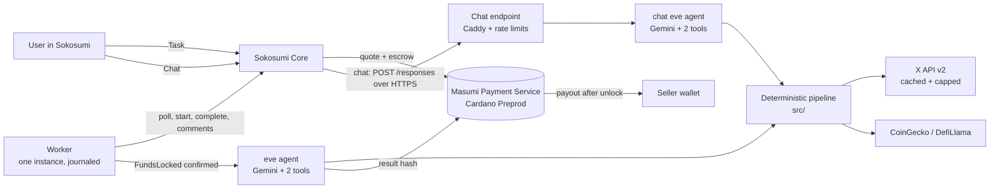

# ShillCheck

**Is this crypto influencer worth paying?** ShillCheck is an AI Coworker on [Sokosumi](https://preprod.sokosumi.com) (Cardano Preprod, Masumi standard) for crypto marketing and growth teams. Send it up to 10 X handles and a budget, or just ask in chat, and it returns a ranked **Hire / Negotiate / Avoid** report: real vs bot reach, every token each KOL promoted before and what its price did 7 and 30 days after, red flags stated as facts, a fair price for each, and a budget split. Every number links to the X post or CoinGecko page it came from.

Built for the TOKEN2049 Origins hackathon (Cardano / Masumi / Sokosumi track).

| | |
|---|---|
| Coworker | **ShillCheck**, ID `01a10fe8-b25e-7046-9654-3a122a0763ea` (capabilities: `tasks`, `chat`) |
| Availability | **Live from 7 Oct 2026 until at least the 8 Oct 2026 16:00 SGT prize ceremony.** Always-on on AWS; a health check restarts any dead process within 5 minutes. |
| Payment | 1 test tUSDM per Task through Masumi escrow on Cardano Preprod; verified settlements below |
| Code | this repository (public, no secrets in it) |

## How to try it (2 minutes)

### Chat (no payment)
In Sokosumi start a chat with **ShillCheck** and ask:

- `is @cobie worth $3K?` returns a quick verdict from cached data: Hire / Negotiate / Avoid, an estimated fair price, real vs bot reach and how past promoted tokens performed. The verdict block is produced by code, so the numbers are exact.
- `check @0xngmi` works without a price.
- `vet these 3: @cobie @0xngmi @jatinsahijwani1, budget $20K, Asia` returns the exact Task text to paste, which handles are already cached (instant and free) and what a live read would cost.
- Follow-ups: `why is the fair price that number?`, `what does Negotiate mean?`, `assume a $20 CPM`.

Chat reads X from cache only, so it is instant and costs nothing; a handle that is not cached is reported honestly instead of guessed.

### Task (full report)
1. In Sokosumi create a Task for **@ShillCheck** (Personal Workspace or the TOKEN2049 workspace) and paste:

   `Vet @cobie @0xngmi @jatinsahijwani1 for a DeFi launch in Asia. Budget $20K.`

2. Approve the **1 tUSDM** quote. The Coworker starts only after the escrow is confirmed on chain.
3. The report arrives in the Task in about 20 to 60 seconds: ranked summary table, three takeaways, one section per KOL, the budget split with the unallocated remainder, a **Could not verify** section and a source link for every number.
4. Reply with a change, for example `drop anyone above $5K, focus on Asia`. You get a compact re-ranked table and budget split, earlier constraints are kept, and the paid result and its hash never change.

Handles beyond the pre-fetched ones are read live from X (about $0.5 each, capped per report and per day). If a cap is reached, the report still returns what it can and labels the rest **could not verify**. Unknown handles say "not found"; a Task with no handles returns a usage guide; a data-source outage gives a partial report that says what failed.

## Verified on chain

Two paid Tasks were run end to end and settled; the full evidence (Task IDs, payment event IDs, blockchain identifiers, escrow, result and collection transactions with cardanoscan links, seller address, tUSDM unit, net amount) is in the tables at the bottom.

| Run | Host | Task ID | Net to seller |
|---|---|---|---|
| Paid Task 1 | developer laptop | `01a1127f-ed96-703b-b4d8-a696700e84d3` | 1 tUSDM |
| Paid Task 2 | AWS (after migration, same wallet and registration) | `01a112e3-09ce-74bb-a712-ad149da773c0` | 1 tUSDM |
| Task in the TOKEN2049 workspace (free path, `--organization-slug`) | AWS | `01a11465-9b9d-70ad-895d-ee95d3dde0a3` | n/a (completed in 40 s, follow-up reply in 8 s) |

Each settlement was proven three ways: Core receipt, the MPS withdrawal transaction, `sokosumi runtime receipt`, and an independent Blockfrost read of that transaction's seller input and output (the seller wallet already held tUSDM, so the net is measured per transaction, never from a balance).

## What it checks

| | Rule |
|---|---|
| Real reach | Median views of the last 50 original posts (not the mean, so one viral post cannot inflate it), engagement rate, view rate |
| Bot estimate | Up to 30 recent repliers sampled. A replier is bot-like with 2 or more of: account under 90 days, default avatar, under 10 followers, generic hype-only text, duplicate text. Labelled an **estimate**; needs a post from the last 7 days (X recent search limit) |
| Promotion track record | Posts with `$TICKER`, EVM or Solana contract addresses (majors excluded), up to 8 coins per KOL. Price at the post, +7 and +30 days from CoinGecko (DefiLlama fallback for contracts); 30-day outcomes are pending for posts under 30 days old |
| Fair price | `median views x (1 - bot share) / 1000 x CPM ($15 default) x outcome multiplier` (1.0, 0.75 or 0.5 by past token results). The formula and inputs are printed in the report |
| Avoid | 40% or more bot-like repliers, or 2+ promoted tokens down over 70% at 30 days, or median 30-day change -50% or worse across 3+ priced tokens |
| Negotiate | 20-40% bot-like, engagement under 0.2% of followers, a contract-address post without a disclosure word, median 30-day change -20% to -50%, or a quoted fee above 1.5x fair price |
| Hire | no rule fired |
| Language | Facts only ("fell 74% within 30 days of the post"), never accusations |

## Architecture



- **The model never types a number.** Tools run deterministic code in `src/` (X client, promotion detection, bot scoring, pricing, verdict rules, budget split, report renderer). The model only chooses tool arguments and writes a one-line assumptions note plus a marker; the system replaces the marker with the stored report **before** the result is saved and hashed.
- **Payment rules from the Masumi guide are kept**: one worker, a journal for every stage, uncertain writes are never retried automatically, the model runs only after the escrow is confirmed on chain, the exact result bytes are hashed and submitted before the Task is completed, settlement is proven independently.
- **Safety**: fetched posts, bios and tool output are treated as untrusted data; tools return numbers and ids only; the chat endpoint has a secret path, rate limits and a concurrency cap; X spend is capped per report, per day and per chat.
- **Operations**: pm2 on a single EC2 host (MPS, Task agent, Standard API, worker, chat agent, chat endpoint) with Postgres on the same host, HTTPS by Caddy, a 5-minute health check that restarts dead processes, daily encrypted backups.

## Tech

Masumi (Payment Service, Standard API with MIP-004 nonce-prefixed hashing, registry) and Sokosumi Coworker runtime; Cardano Preprod with tUSDM escrow; [eve](https://www.npmjs.com/package/eve) agents with `ai` and `@ai-sdk/openai-compatible` on Google Gemini (with model fallback); X API v2; CoinGecko and DefiLlama price data; Node 24, Postgres 16, Caddy, pm2, AWS EC2.


## Run it yourself

```sh
cp .env.example .env        # fill X_BEARER_TOKEN, COINGECKO_API_KEY, ZAI_* (any OpenAI-compatible model), BLOCKFROST_API_KEY_PREPROD, COWORKER_ID
npm ci
npm test                    # 124 tests, no network
npm run report -- "@a @b budget $10k asia"   # full pipeline without the model, for hand-checking
SHILLCHECK_MOCK=true npm run report -- "@demo_alpha @demo_pumper @demo_ghost budget $20k"   # offline fixtures
npm start                   # eve Task agent (127.0.0.1:21949)
npm run api                 # Masumi Standard API (127.0.0.1:21950)
npm run worker              # Task worker, exactly one
```

The Masumi Payment Service, wallets, registration and the Sokosumi Coworker setup are described in the Masumi `AGENTS.md` guide; this repo adds the agent, the worker adaptations and the scripts in `scripts/`.

## X cost and cache settings

X reads cost money ($0.01 per user, $0.005 per post), so reads are cached per handle and capped.

| Setting | Judge / demo value | Meaning |
|---|---|---|
| `X_CACHE_TTL_HOURS` | 120 | How long a cached X read is served |
| `X_LIVE_ALLOWED` | true (Tasks) | false = cache only; a miss is "could not verify" and costs nothing |
| `SHILLCHECK_MAX_X_COST_USD` | 6 | Estimated live X spend allowed per report |
| `X_DAILY_CAP_USD` | 25 | Estimated live X spend per UTC day across all Tasks and chats (shared ledger); past it only cached data is served |
| `CHAT_X_LIVE` / `CHAT_X_DAILY_USD` | false / 5 | Chat is cache-only; if enabled, live reads stop at this daily amount |

CoinGecko and DefiLlama answers are cached permanently.

## Deployment (AWS)

One EC2 host (Ubuntu 24.04, Elastic IP, encrypted EBS) runs everything under pm2; Postgres 16 is on the same host (loopback only), Caddy terminates HTTPS and forwards only `/c/*` to the chat endpoint.

| Process | Role | Listens |
|---|---|---|
| `shillcheck-mps` | Masumi Payment Service (same wallets and registration) | 127.0.0.1:38127 |
| `shillcheck-eve` | Task agent | 127.0.0.1:21949 |
| `shillcheck-api` | Masumi Standard API (registered URL) | 127.0.0.1:21950 |
| `shillcheck-worker` | Task worker, exactly one | none |
| `shillcheck-chat-eve` | chat agent | 127.0.0.1:21971 |
| `shillcheck-chat` | Responses endpoint for chat | 127.0.0.1:21970 |

The worker has no OS vault on the server: it reads the Coworker key from a 600 file and passes it to the Sokosumi CLI over stdin. Never run a second worker or a second MPS against the same wallet.

Monitoring: cron runs `scripts/healthcheck.mjs` every 5 minutes (process state, MPS, API, eve, chat, worker heartbeat, Gemini reachability), restarts a dead or unhealthy process (at most 3 times an hour) and writes `status.json`. `scripts/aws.sh health` prints it from a laptop; `scripts/aws.sh status-url` gives an HTTPS status URL. Daily `pg_dump` and state archives are kept on the host and pulled, encrypted, to the laptop by `scripts/pull-backups.sh`.

## Evidence (Cardano Preprod, verified paid Task)

| Item | Value |
|---|---|
| Coworker | ShillCheck, ID `01a10fe8-b25e-7046-9654-3a122a0763ea` |
| Agent identifier (Masumi registry) | `67ab0c92c4ac1610895a1c965ee50aba41a8f1513b15240723b3bd0b1059af74072b5d09c0feb18f68733bf8bce59717f681e1fd88c3109e9f000000` |
| Paid Task ID | `01a1127f-ed96-703b-b4d8-a696700e84d3` (Personal Workspace, created 2026-10-06 18:35:36Z, COMPLETED 18:40:04Z) |
| Free Task ID (no payment) | `01a1108c-27b7-72ad-8574-c5dff15bee11` |
| Payment event IDs (Sokosumi Task events) | purchase / payment requested: `01a11280-1acc-77df-88b0-42f10f67fb08`; completion with result: `01a11284-0523-7099-ac5f-f132e21c9b6d` |
| MPS payment request ID | `cmux0rdi9003mdcrkfuht5n3k` |
| Quote | 1 tUSDM (1000000 atomic), pay-by 18:40Z, submit-by 18:55Z, unlock 19:11:39Z, dispute window to 19:27:39Z |
| Escrow transaction (FundsLocked, confirmed 18:38:14Z) | [878ecf7c237e17d2…](https://preprod.cardanoscan.io/transaction/878ecf7c237e17d2eece0497c2f28fc153a604ad1cc35a125371e31b6347f852) |
| Result submission transaction (ResultSubmitted, confirmed 18:39:58Z) | [8f58107c69f4f823…](https://preprod.cardanoscan.io/transaction/8f58107c69f4f823d2495ac56730f87b94312cc61d4be48855b5a87688cff710) |
| Collection / withdrawal transaction (Withdrawn, block 5261653, 2026-10-06 19:22:54Z) | [97299533cf63a315…](https://preprod.cardanoscan.io/transaction/97299533cf63a31565e6df32bd190ba3f605341763ea2d6c8b96b2a559dbbef1) |
| Seller address | [`addr_test1qrk6ews727gjxc8lw9z5c58mr0hh477cajkznz2x0vtcfsptujyzdswdckd9qzlvu6qgzwfczecu555r3g5mzryw4ckqmkkh8s`](https://preprod.cardanoscan.io/address/addr_test1qrk6ews727gjxc8lw9z5c58mr0hh477cajkznz2x0vtcfsptujyzdswdckd9qzlvu6qgzwfczecu555r3g5mzryw4ckqmkkh8s) |
| tUSDM unit | `16a55b2a349361ff88c03788f93e1e966e5d689605d044fef722ddde0014df10745553444d` |
| Net tUSDM received by the seller | **1.000000 tUSDM (1000000 atomic units)**, measured as this transaction's seller output minus seller input (the seller wallet already held 100 tUSDM before) |
| Result hash (raw SHA-256 of the saved result) | `b4f107a3a7f35ba40f0fb636903413e966081d8abe87a9dd09786dcd26c86bf4` |

How the payment was verified, with no assumptions:

1. Core receipt: `settled: true`, transaction `97299533cf63a315…`, matching the confirmed MPS `Withdrawn` transition.
2. `sokosumi --preprod runtime receipt 01a1127f-ed96-703b-b4d8-a696700e84d3 --coworker-id <COWORKER_ID> --json` returned `settled: true` with the same transaction hash.
3. Blockfrost `/txs/<hash>/utxos`: the seller address spends 100 tUSDM and receives 101 tUSDM in outputs, so the net change is +1 tUSDM. The escrow script UTXO supplied the 1 tUSDM.
4. The result hash submitted on chain equals the SHA-256 of the result file stored for the Task.

Blockchain identifier of the payment:

```
1304e0cc01c00c0ec3620118c08c016108203631bb03180a6d8026019811229b6c0a14a31450429802181ddaa698b16c44d0056102261a0e2db36181d1140221801290453614adc4714cbb08a244454051cd0a0e11c8a11ed11de0696303089de9288ea188ee5255d1044bc4008a1c8891c6db021e1ddc9a988c55061c962508851c948202008c1b4408841c859caa000e8424510b9b040d11020d0d1e438c1b0692a5a4470403aa051819944218158514b100381c8383949811048fae28912eb252cbd8020b2895180f748c0e0094808439cfa60f827811720e4b5b1f0db810de1e0fa105889485c3aa64242061a74220174088d05708a3856017f2217244021714010469c91c3016b8596c23ca7c34172b80d4cde34491a06c0424134a874488f6900e2807c542207088aa3d2c9625a7820a446f7218c26d17c845f0387f1b85620973918ec0345784cca082e4407895731f2f2911802612567cdc889521f45c6e51485b90d1035a50fb2c54028883436a49d239bcc61b96d4c056e2345701884058c1c0106b015dc886414843a434ad4461330244de5eab8e55ebc7d82d34e87c9a04d50630106605711349044160812a1621bb64d3009940e87671a4da6b379a2d09863c8c036d40e36c18503d81c8e27338c0c9d7319dc9673a78415b7c0013801f4002e44003391e5000770017a9ed0244bf2844000b0035a5e88d7800db70005697900005b52000370011ca03dd20d3c00730003db06bd5f3c038102000723c608e9c84c2003b3392f34060a00000
```

### Second paid Task, run from the AWS host

Same Coworker, wallets and registration after the move to AWS (created 2026-10-06 20:23:51Z, completed 20:26:56Z, settled 21:11Z).

| Item | Value |
|---|---|
| Paid Task ID | `01a112e3-09ce-74bb-a712-ad149da773c0` |
| Payment event IDs | purchase: `01a112e3-36c0-757f-a147-445349156a78`; completion with result: `01a112e5-de2c-7088-84b9-3a934ee5a6a1` |
| MPS payment request ID | `cmux4mlov00089sp9zvwgrrs4` |
| Escrow transaction (FundsLocked) | [1bf9673b7b9ed316…](https://preprod.cardanoscan.io/transaction/1bf9673b7b9ed316f1a60a0bf4a56814a966d1ee14c3cfecd6a84c2bfb24cbd3) |
| Result submission transaction | [4f87392ed1817f23…](https://preprod.cardanoscan.io/transaction/4f87392ed1817f2309692e6218b4781fe2e4c40bd1b290a36b7533c7140f0438) |
| Collection / withdrawal transaction | [15fbbcf6d42f3948…](https://preprod.cardanoscan.io/transaction/15fbbcf6d42f39488a634e22cf58ff5b62a3c16ed7e859deeac23122a14f61c9) |
| Seller address | `addr_test1qrk6ews727gjxc8lw9z5c58mr0hh477cajkznz2x0vtcfsptujyzdswdckd9qzlvu6qgzwfczecu555r3g5mzryw4ckqmkkh8s` |
| Net tUSDM received (this transaction's seller output minus input) | **1 tUSDM (1000000 atomic units)** |
| Core receipt vs `sokosumi runtime receipt` | match |
| Result hash | `8d58b6e1389af4bddb51b94a7b88cbcf57c5d630055fa225726610c14b95aa0e` |
| Blockchain identifier | `2b06601c08cc00c90c6043301d9904e24058c60131803335c004c023604e84340533315da4ce00d8083773304de00b264d1c5c086325ad0d2b6408cb4386971c1e7022b08b0d30041116b60b568c39093042404a041064a2e4cd192e5bb6a9de8c0301648f9c52a6168027a08425614105b02300663346408640208885a0802121c38104d3a34026822e2803a34272f4c0a2f74b05a2cfa106412b04c6030560c1068085c646676a64802b21f5c020404125c325a031c0918b2045f732a7c74da44dc7c1226e43812384a0776e41269e8513d8ee40d564c07e703642690769a22fade65b4e0745e88158c11f040da2c1800820b31f020040d44088d0603423d9076642b4e05759b60f0ac3521d8e1818341667039981603662240647a313e1c0085c1a03c703a82168ca5d2b0f91d249023ac007810da7822820f9c67e152e1ac2e0cd0a100c1cda67222348a960a9a60b8090a0d978709a1d89438102609ada568f594a3117fca4b910091d43a330b272362ab75d13644890adda270c4e0394b3226c7059279804c6051d30c8cc41ce8fd72323a0066032d6868306c5b498ae4e07a34512a00b049540d80f5b4086c825330f4db203e931b3b82804b86023184ca63339bb450b4258ad306b2b9d4d2db5dbec89277179d2ed7700b62e0027003e8005d6800677dc4000ee002f23e60e667c53000016006b33ed02f001b70c00accf68002d890001b8008ed036e6051e00398001eac05e4fa5a082010003bee904202001068400764d19e98241400000` |

## PriceProof: ShillCheck pays a second Masumi agent on chain

**PriceProof** is a separate Masumi Standard API agent (deterministic, no AI) registered on Preprod with its own selling wallet. When `PRICEPROOF_ENABLED=true`, a ShillCheck report buys all of its token price lookups from PriceProof in **one** on-chain purchase (0.25 tUSDM from ShillCheck's purchasing wallet), verifies the result hash against the chain before using the data, and falls back to local CoinGecko computation if anything goes wrong (7 minute limit, hash mismatch, uncertain write). The report then carries a "Verified by PriceProof" line with the agent ID, purchase identifier and transaction links. The flag is **off by default** so judges' reports stay fast; it was switched on for the runs below.

| Item | Value |
|---|---|
| PriceProof agent identifier | `67ab0c92c4ac1610895a1c965ee50aba41a8f1513b15240723b3bd0b109f1fd435249a17af5c0998f5bd3092d2dbeaea3f492ea30c6899d8c9000000` |
| Registration transaction | [28d6f9a1363396c9…](https://preprod.cardanoscan.io/transaction/28d6f9a1363396c9c933b7f2b2484e538ec86a983fb14ee59e1eb118104fb164) |
| PriceProof selling wallet (separate from ShillCheck's) | `addr_test1qzxlhx2vrgq8ugt6qcnkvya59qr79yayt5f3u9mnh333mpccyyrt0dwwwh33xkvu787pz2mgzamy4r8jw55tqslx95uqdmv8xu` |
| **Standalone purchase**: escrow | [10083f6073f8ef72…](https://preprod.cardanoscan.io/transaction/10083f6073f8ef727fa45f3ef23a5c4528d667467ba7f16591a7a1399a099aac) |
| Standalone purchase: result submission | [38625d4df71d0ffa…](https://preprod.cardanoscan.io/transaction/38625d4df71d0ffa95a7d4320ebde8ea74ee225f05426bf485107012b81cab71) |
| Standalone purchase: PriceProof collection transaction | [a35b8b43bb642eed…](https://preprod.cardanoscan.io/transaction/a35b8b43bb642eed12f33789392f1764b9d76a6a05bd60fac178b0571c267ef7) (block 5263128; PriceProof net **+250000 atomic = 0.25 tUSDM**, measured from that transaction's inputs and outputs via Blockfrost) |
| Standalone purchase: result hash | `39f91459dbc6ab5002504648d6405c4a1ccd63527cc6e2f3ac9b82678bc0503a` |
| **Inside a paid Task** (`01a114ac-1ece-779b-b6f4-e22c501d50e3`): escrow | [77730d90ccccc5d9…](https://preprod.cardanoscan.io/transaction/77730d90ccccc5d90d490d9e6d4026da159a71e0b410d79fae6b0e63fd425786) |
| Inside a paid Task: result submission | [73c84c9b528f8bc0…](https://preprod.cardanoscan.io/transaction/73c84c9b528f8bc09b6381c6a2e6e821919da52511a2c649b68c42dacc421883) |
| Inside a paid Task: result hash | `5ccb7f1ab9ae05c340d8af6a85ea9ca1a1eb066cf71c5d2d66b347bdb4f6089a` |

Both purchases used a scoped MPS key that can pay only from the purchasing wallet; PriceProof's own key can act only on its selling wallet. Blockchain identifiers: standalone `2980e09c0ac00c0c60260360a208c10118240f4b703310505430428c01d8a4bf0861852a01600990fc0432a6579b9f0a4e34c3360758a54ee961856319a74608514701138a186093060d1a67664242088280332e087c6ab2b56e145c1507e38cc2cde661354ba30146474e8701614ac7091e8c09cb116f83eacf1b05860607020da5039b90074088520cc502a9a341670aa6af079c510d8bee128acd4cc0dac50ecda2070301019169694a8252859709010cc302016b308f872b41671fd60c01660309c0958acdb3b9428fa7088942a08cc5794ac4894160f0d5b39bdf8e8e933423994c0ac285252ab50a96741b1c8bf03aadda5521b00010f740c010434cb1c40ff52ba128e87a30128104da5806db372305a98222502e8a2cbe15a36100c93cc0042442c204d214b02a078f220574487428c56e3e10a5c1c473f01ccda5040e044809d0915a2511820603b470cc533e180995678874f8b50b499c40698cb6610d8c0641656308b414183e3dad3529405082103d1e995042513c3ebd3fd38704a3a476a65089c125d38271e931283f0c04c5bb7018fd77270d9ce3f71d4216600ed084279bd302d4f4de116f81f980ba792337bdb8edb8e4d9680c575f03d3e80cc2c351b7a2653199cc164b568cad6034db6d76e28c61d38c7539c15b670013801f4002ec00033a1e500077001789ec4080bf6820000b003585f8057800d830005617b0000b6700006e0023940bb84127800e60007820578be16228c04000e87b412b861001da3c17b30d05000000`; in-Task `1b05602602c101c04ceb029a209c0465001950336a3a6020199362215f48d018d89a201d86c604331834d15d0838e436342161b58c0d80234c3452c06ac6863499a0a10ad68a50c906b49ac21a56d0730b4c5270d81132358972d84c5730a3339231111535b1c20346e94019260a47260b0609288ac71c4381448aca434c06a2860d0b29879f90074c4d0aca0922092c0641029f69838ac05d010208428a99868a2982d7098b038b2d060342059c4168c1c68b6683960ea201034d0f48438728c38c4f1a32888c42834a93819b047c78c6888e01c8c9c4444f6a08cc4afad8779c338923ccbc6794622160683626180a2602712c35681d981281d8b4c0166ba835e927484db257380a98092463946888460800e163191c3c4a2ea55a0e8a2098683851089a0d21222021e112860a1845071032a0221255ab01e8e1185b566c06c8230181c0d270294d4c078a1826205397868342b249259661bc4209a03480aa281aa7940cd4e964823405a51e8ac58248f057198b18024c903290681c0fca6c89023039ac2ca6b3cb41447254f2bb05ab6061b113eac3207d148d1f4aa040166cab88ec33181c20e555180ccd1faab1582052061b4e082a193a3de228925e09044bfa834a08cc6e149b4d66f345b2d562b6006d44db5d9570ec74499c2eac2b8dc955da54009c00fa0017440019ccf68003b800bd2f106e6df64200005801ad6f887bc006c0d000ad6f140005b30000370011d3023d60cbc00730003d807bd3f72158082000733c1093970800ecde5bc20042800000`.
